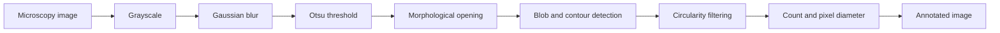

# Microscopic Bubble Detection with OpenCV

A desktop image-analysis prototype for detecting, counting, and measuring bubble-like structures in microscopic images using classical computer vision.


> [!IMPORTANT]
> This repository is an experimental prototype. Its thresholds, contour rules, and pixel-based diameter measurements must be calibrated and validated before scientific, industrial, or production use.

## Overview

The project applies an explainable OpenCV pipeline to microscopy images and provides two ways to explore the result:

- a PyQt5 desktop interface for selecting and processing an image
- a standalone batch-processing script for local JPEG files

The implementation estimates bubble count through OpenCV's blob detector and highlights approximately circular contours with bounding boxes, centroids, and pixel diameters.

## Processing pipeline



### Current algorithm

1. Convert the image from BGR to grayscale.
2. Apply Gaussian smoothing with an `11 × 5` kernel.
3. Compute a binary image with Otsu's threshold.
4. Apply a `3 × 3` morphological opening.
5. Detect blobs and contours.
6. Approximate each contour and retain shapes with more than six vertices.
7. Draw the contour, bounding rectangle, centroid, and horizontal diameter.
8. Display the detected count and diameter measurements.

## Repository structure

```text
.
├── assets/
│   └── 2023-01-28.gif       # Existing application demonstration
├── bubleDetection.py        # Standalone batch-processing prototype
├── bubleDetectionQt.py      # PyQt5 desktop application
├── ui_QtSoftware.ui         # Editable Qt Designer interface
├── ui_MainWindow.py         # Generated Python UI module
├── ui_Converter.py          # UI code-generation helper
├── requirements.txt         # Runtime dependencies
└── README.md
```

The existing filenames use the historical `buble` spelling. They are retained to avoid breaking imports and existing references.

## Requirements

- Python 3
- A desktop environment capable of displaying a PyQt5 window
- JPEG or another OpenCV-readable microscopy image
- Qt Designer only if you want to edit and regenerate the interface

## Installation

Clone the repository and create an isolated environment:

```bash
git clone https://github.com/xioubin/Bubble-Detection-openCV-.git
cd Bubble-Detection-openCV-

python -m venv .venv
```

Activate the environment:

```bash
# Linux or macOS
source .venv/bin/activate

# Windows PowerShell
.venv\Scripts\Activate.ps1
```

Install the dependencies:

```bash
python -m pip install --upgrade pip
pip install -r requirements.txt
```

## Usage

### Desktop interface

Start the PyQt5 application:

```bash
python bubleDetectionQt.py
```

Suggested workflow:

1. Select an image with **SELECT FILE**.
2. Load the selected image into the preview.
3. Run the image-processing action with **READ**.
4. Review the annotated image, detected count, and reported pixel diameter.

The **SAVE** action is currently a placeholder and does not persist results.

### Standalone prototype

`bubleDetection.py` scans a JPEG directory and opens an OpenCV result window for each image:

```bash
python bubleDetection.py
```

Before running it, replace the hard-coded input glob near the beginning of `main()` with a path available on your machine:

```python
glob.iglob("path/to/images/*.jpg")
```

Press a key in the OpenCV window to continue to the next image.

### Regenerating the Qt UI

`ui_MainWindow.py` is generated from `ui_QtSoftware.ui`. The current `ui_Converter.py` contains a machine-specific absolute path. A portable equivalent is:

```bash
python -m PyQt5.uic.pyuic -x ui_QtSoftware.ui -o ui_MainWindow.py
```

Do not manually edit generated UI code unless you intend those changes to be overwritten the next time the UI is generated.

## Measurement interpretation

Reported diameters are bounding-box widths measured in pixels. They are not physical units.

To report micrometres or another real-world unit, calibrate the image scale using known microscope metadata or a reference object:

```text
physical diameter = pixel diameter × physical units per pixel
```

The current interface displays a diameter for each accepted contour as it is processed; it does not yet provide a distribution, aggregate area, or exported table.

## Current limitations

- The standalone script contains a machine-specific Windows image path.
- Parameters are fixed in source code rather than configurable through the UI or command line.
- The **SAVE** action is not implemented.
- Pixel measurements are not calibrated to physical units.
- Detection quality has not been documented against labelled ground truth.
- The same rules may not generalize across magnification, illumination, contrast, focus, or bubble morphology.
- The current code should guard against zero-area moments before calculating a centroid.
- Centroid and color-display calculations require verification.
- OpenCV blob-detector parameters are not consistently applied in every supported OpenCV branch.
- The current `natsort` import should be verified against the installed package API.
- There are no automated tests or reproducible evaluation datasets in the repository.

## Tuning guide

Useful parameters to expose in future iterations include:

- Gaussian blur kernel size
- morphological kernel size and iteration count
- minimum and maximum blob area
- minimum circularity and convexity
- contour approximation tolerance
- minimum and maximum diameter

Record parameter sets together with microscope magnification and acquisition conditions so that results can be compared meaningfully.

## License

No repository-level license has been declared. Until one is added, the project remains under the copyright holder's default rights and should not be assumed to be open source.

## Suggested next steps

- replace hard-coded paths with command-line arguments or configuration
- separate image processing from the GUI
- return structured detection records from a reusable function
- add calibrated units and summary statistics
- implement CSV and annotated-image export
- create labelled fixtures and quantitative evaluation
- add automated tests for empty images, border objects, and zero-area contours
